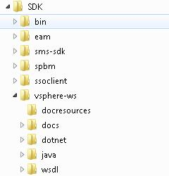
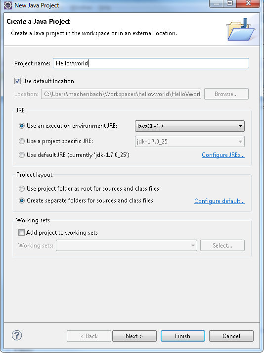
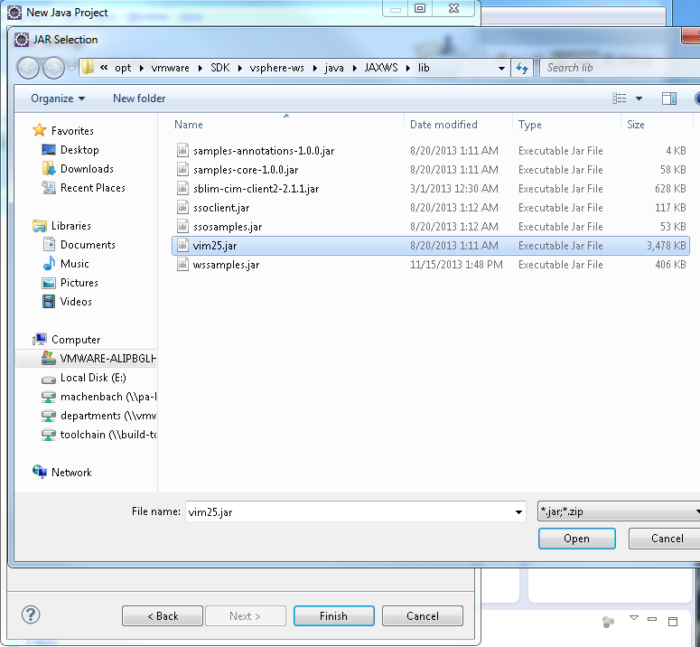
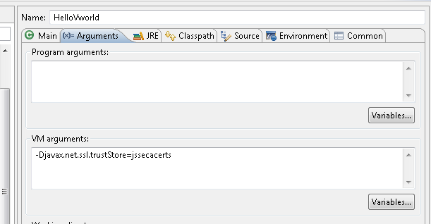

# Hello, VMware World

If you are a software developer new to the VMware management stack, you may have noticed that the learning curve for 
it is a little steep.  This is partly because of the breadth of offerings and the number of different ways you may 
need to use VMware products.  This can lead to an overload of information.

This is the first in a series of articles that will walk through the process of getting set up and using the vSphere 
Management SDK.

My audience is developers of software products that will manage, monitor, analyze, automate or otherwise interact 
with virtual resource controlled by VMware infrastructure.  I'm not addressing device drivers or low level development, 
nor am I addressing scripts to automate specific IT operations.  My assumption is that you are building a product to 
package and sell.

Here are my assumptions

* You're a profession developer conversant in Java and probably several other programming languages.
* You have access to a development environment that has vSphere and vCenter running on it.
* You understand the basic concepts of virtualization, and vSphere  in particular.
* You don't have time to read through 1000 pages of documentation, and would like to see something running quickly.

We'll be running through a set of tutorials and samples hosted in the new VMware Developer Center, along with several 
others.  Many of these are included in the SDK, some are new.  With the Developer Center we are trying to pull 
together all the information and tools developers and partners will need to develop and bring their product to market.

Let's start with every programmer's favorite, "Hello, World".   In this article we will cover the following topics

* Download and install the vSphere Management SDK for java
* Set up a Java development Environment
* Connect to the vCenter server
* Learn two ways to set SSL for a development environment

## What do we need?
In this tutorial I'll be using 

* Java 1.7 (http://www.oracle.com/technetwork/java/javase/downloads/index.html) 
* Eclipse (Juno or Kepler)  http://www.eclipse.org/downloads/
The use of Eclipse is optional, I just happen to like it.  If you prefer something different, please feel 
free to use it.
* vSphere Management SDK 5.5.0 http://developercenter.vmware.com/web/sdk/55/vsphere-management
The download site has two zip files:  VMware-vSphere-SDK-5.5.0-<nnn>.zip and 
UpdateSite-SDK-vSphereManagement-Java_5.5.0.<nnn>.zip.  For this exercise we will use 
VMware-vSphere-SDK-5.5.0-<nnn>.zip. 

## Getting set up

* Unzip the SDK into a known location.  I used /opt/vmware.  All files will be in a folder called "SDK"



* Start Eclipse, and create a new Java Project, "HelloVworld".  Click "Next" on the new project wizard



* Select Libraries on the Java Settings Tab, and click "Add External JARs".  Navigate to the 
SDK/vsphere-ws/java/JAXWS/lib folder and select vim25.jar


* Click Open, then Finish



That's it for setup.  With our new project, we are now ready to start the HelloVworld program.

##Coding HelloVWorld

The example we'll put together is documented in the SDK Documentation 
http://pubs.vmware.com/vsphere-55/index.jsp#com.vmware.wssdk.pg.doc/PG_Client_App.5.4.html as well as the "Connect 
to vSphere from a Java Program" sample in the VMware Developer Center.

First create a class HelloVworld.java with an empty static main.

```java
public class HelloVworld {

	public static void main(String[] args) {
		// TODO Auto-generated method stub

	}

}
```
 
Add in the url we use to connect to API.  This will be the address of your vCenter server, followed by
"/sdk/vimService".  Let's also add the user name and password.
 
```java
public static void main(String[] args) {
	String url = "https://yourhostname/sdk/vimService";
	String user = "username";
	String password = "password";

}
```

Now we add the code to set the connection.  Use an instance of VimService to obtain a VimPortType.  The VimPortType 
contains the endpoint of the service, and is used to invoke many of the server methods.

```java 
// Create a VimService object to obtain a VimPort binding provider.
// The BindingProvider provides access to the protocol fields
// in request/response messages. Retrieve the request context
// which will be used for processing message requests.


VimService vimService = new VimService();
VimPortType vimPort = vimService.getVimPort();
```
We now store the server url in the BindProvider, provided by the RequestContext of the VimPort.

```java
// Store the Server URL in the request context and specify true
// to maintain the connection between the client and server.
// The client API will include the Server's HTTP cookie in its
// requests to maintain the session. If you do not set this to true,
// the Server will start a new session with each request.

Map<String, Object> ctxt = ((BindingProvider) vimPort).getRequestContext();
ctxt.put(BindingProvider.ENDPOINT_ADDRESS_PROPERTY, url);
ctxt.put(BindingProvider.SESSION_MAINTAIN_PROPERTY, true);
```
 
Next we will create a Managed Object Reference to the singleton ServiceInstance, and use this reference to obtain a 
copy of the Service Instance content. 

```java
ManagedObjectReference serviceInstance = new ManagedObjectReference();
serviceInstance.setType("ServiceInstance");
serviceInstance.setValue("ServiceInstance");

try {
	ServiceContent serviceContent = 
			vimPort.retrieveServiceContent(serviceInstance);
} catch (RuntimeFaultFaultMsg e) {
	e.printStackTrace();
}
``` 

Finally we will log in to the system, print some information, and log out.

```java
try {
	ServiceContent serviceContent = 
			vimPort.retrieveServiceContent(serviceInstance);
	vimPort.login(serviceContent.getSessionManager(), user, password, null);
	
	// print out the product name, server type, and product version
	System.out.println(serviceContent.getAbout().getFullName());
	System.out.println("Server type is " + 
			serviceContent.getAbout().getApiType());
	System.out.println("API version is " + 
			serviceContent.getAbout().getVersion());
	
	vimPort.logout(serviceContent.getSessionManager());

} catch (RuntimeFaultFaultMsg e) {
	e.printStackTrace();
} catch (InvalidLocaleFaultMsg e) {
	e.printStackTrace();
} catch (InvalidLoginFaultMsg e) {
	e.printStackTrace();
} catch (KeyManagementException e) {
	e.printStackTrace();
}
 ```
 
When done, our final code will look like this

```java
package hello2;

import DisableSecurity;

import java.security.KeyManagementException;
import java.security.NoSuchAlgorithmException;
import java.util.Map;

import javax.xml.ws.BindingProvider;

import com.vmware.vim25.InvalidLocaleFaultMsg;
import com.vmware.vim25.InvalidLoginFaultMsg;
import com.vmware.vim25.ManagedObjectReference;
import com.vmware.vim25.RuntimeFaultFaultMsg;
import com.vmware.vim25.ServiceContent;
import com.vmware.vim25.VimPortType;
import com.vmware.vim25.VimService;

public class HelloVworld {

	public static void main(String[] args) {
		String url = "https://yourhostname/sdk/vimService";
		String user = "username";
		String password = "password";

		// Create a VimService object to obtain a VimPort binding provider.
		// The BindingProvider provides access to the protocol fields
		// in request/response messages. Retrieve the request context
		// which will be used for processing message requests.
		
		VimService vimService = new VimService();
		VimPortType vimPort = vimService.getVimPort();

		// Store the Server URL in the request context and specify true
		// to maintain the connection between the client and server.
		// The client API will include the Server's HTTP cookie in its
		// requests to maintain the session. If you do not set this to true,
		// the Server will start a new session with each request.
		
		Map<String, Object> ctxt = ((BindingProvider) vimPort).getRequestContext();
		ctxt.put(BindingProvider.ENDPOINT_ADDRESS_PROPERTY, url);
		ctxt.put(BindingProvider.SESSION_MAINTAIN_PROPERTY, true);

		ManagedObjectReference serviceInstance = new ManagedObjectReference();
		serviceInstance.setType("ServiceInstance");
		serviceInstance.setValue("ServiceInstance");

		try {
			ServiceContent serviceContent = 
					vimPort.retrieveServiceContent(serviceInstance);
			vimPort.login(serviceContent.getSessionManager(), user, password, null);
			
			// print out the product name, server type, and product version
			System.out.println(serviceContent.getAbout().getFullName());
			System.out.println("Server type is " + 
					serviceContent.getAbout().getApiType());
			System.out.println("API version is " + 
					serviceContent.getAbout().getVersion());
			
			vimPort.logout(serviceContent.getSessionManager());

		} catch (RuntimeFaultFaultMsg e) {
			e.printStackTrace();
		} catch (InvalidLocaleFaultMsg e) {
			e.printStackTrace();
		} catch (InvalidLoginFaultMsg e) {
			e.printStackTrace();
		} catch (KeyManagementException e) {
			e.printStackTrace();
		}

	}

}
```

Let's compile and run.  In Eclipse, right click on the "HelloVworld.java" file in the project browser, and select 
"Run as > Java Application", or from the command line:

```
C:\HelloVworld\src>javac -cp ".; <SDK libr>/vim25.jar" HelloVworld.java
C:\HelloVworld\src>java -cp ".; <SDK libr>/vim25.jar" HelloVworld
```
Unless you installed vCenter with trusted certificates, you got an error like this:	

```
Exception in thread "main" com.sun.xml.internal.ws.client.ClientTransportException: HTTP transport error: javax.net.ssl.SSLHandshakeException: sun.security.validator.ValidatorException: PKIX path building failed: sun.security.provider.certpath.SunCertPathBuilderException: unable to find valid certification path to requested target
	at com.sun.xml.internal.ws.transport.http.client.HttpClientTransport.getOutput(HttpClientTransport.java:117)
	at com.sun.xml.internal.ws.transport.http.client.HttpTransportPipe.process(HttpTransportPipe.java:194)
	at com.sun.xml.internal.ws.transport.http.client.HttpTransportPipe.processRequest(HttpTransportPipe.java:122)
	at com.sun.xml.internal.ws.transport.DeferredTransportPipe.processRequest(DeferredTransportPipe.java:123)
	at com.sun.xml.internal.ws.api.pipe.Fiber.__doRun(Fiber.java:626)
	at com.sun.xml.internal.ws.api.pipe.Fiber._doRun(Fiber.java:585)
	at com.sun.xml.internal.ws.api.pipe.Fiber.doRun(Fiber.java:570) …

```

This is caused by the self-signed certificates generated for SSL with vCenter.  The vSphere API/SDK Documentation 
describes several solutions for this.  We will discuss two of them here.

## Handling SSL in the Developer Environment

First we will look at getting and using the server's certificate, using a utility written by Andreas Sterbenz of 
Sun called InstallCert.  Source and references for it can be found on github.  The vSphere API/SDK Documentation 
also describes other ways to get this in the section "Obtaining Server Certificates", which you may want to read.

To run InstallCert, you just supply the host and port of the server, and the server's certificate will be 
installed into a new keystore.  I should point out that the code for InstallCert is somewhat brittle.  If you 
intend to use it often, you may want to refactor it.

```
HelloVworld\src> java InstallCert 1.2.3.4
Loading KeyStore C:\opt\Java\jdk-1.7.0_25\jre\lib\security\cacerts...
Opening connection to 1.2.3.4:443...
Starting SSL handshake...
 <Stack trace from invalid certificate>
Server sent 1 certificate(s):
 <Certificate Information>
Enter certificate to add to trusted keystore or 'q' to quit: [1]
1
 <More output>
Added certificate to keystore 'jssecacerts' using alias '1.2.3.4-1'
```

 
This creates a new trusted key store on the current directory called "jssecacerts".  We can use this keystore 
with the java property javax.net.ssl.trustStore to have our version of SSL use this keystore.  In Eclipse, 
we set it on the Arguments tab of the run configuration.


 
Or use the –D option of the command line

```
HelloVworld\src>  java -Djavax.net.ssl.trustStore=jssecacerts -cp ".; <SDK libr>/vim25.jar" HelloVworld
```

We should now finally see the output of the HelloVworld program

```
VMware vCenter Server 5.5.0 build-1398495
Server type is VirtualCenter
API version is 5.5.0
```
 
This method does not always work, however.  An alternative that will always work for a development system is 
to modify SSL so that it will trust all certificates.  **This method must never be used in a production environment.**

To trust all certificates, we will introduce a class called DisableSecurity. 
 
 ```java
import java.security.KeyManagementException;
import java.security.NoSuchAlgorithmException;

import javax.net.ssl.HostnameVerifier;
import javax.net.ssl.HttpsURLConnection;
import javax.net.ssl.SSLSession;

public class DisableSecurity {

    /*
     * Authentication is handled by using a TrustManager and supplying a host
     * name verifier method. (The host name verifier is declared in the main function.)
     *
     * Do not use this in production code!  It is only for samples.
     */
    private static class TrustAllTrustManager implements javax.net.ssl.TrustManager, javax.net.ssl.X509TrustManager {

        public java.security.cert.X509Certificate[] getAcceptedIssuers() {
            return null;
        }

        public void checkServerTrusted(java.security.cert.X509Certificate[] certs, String authType)
            throws java.security.cert.CertificateException {
            return;
        }

        public void checkClientTrusted(java.security.cert.X509Certificate[] certs, String authType)
            throws java.security.cert.CertificateException {
            return;
        }
    }

	public static void trustEveryone()
			throws NoSuchAlgorithmException, KeyManagementException {
		// Declare a host name verifier that will automatically enable
        // the connection. The host name verifier is invoked during
        // the SSL handshake.
        javax.net.ssl.HostnameVerifier verifier = new HostnameVerifier() {
            public boolean verify(String urlHostName, SSLSession session) {
                return true;
            }
        };
        // Create the trust manager.
        javax.net.ssl.TrustManager[] trustAllCerts = new javax.net.ssl.TrustManager[1];
        javax.net.ssl.TrustManager trustManager = new TrustAllTrustManager();
        trustAllCerts[0] = trustManager;

        // Create the SSL context
        javax.net.ssl.SSLContext sc = javax.net.ssl.SSLContext.getInstance("SSL");

        // Create the session context
        javax.net.ssl.SSLSessionContext sslsc = sc.getServerSessionContext();

        // Initialize the contexts; the session context takes the trust manager.
        sslsc.setSessionTimeout(0);
        sc.init(null, trustAllCerts, null);

        // Use the default socket factory to create the socket for the secure connection
        javax.net.ssl.HttpsURLConnection.setDefaultSSLSocketFactory(sc.getSocketFactory());
        // Set the default host name verifier to enable the connection.
        HttpsURLConnection.setDefaultHostnameVerifier(verifier);
	}


}
 ```
 
To use this, we now insert a call to DisableSecurity.trustEveryone before making any ssl calls:

```java
try {
	// Disable all SSL trust security
	DisableSecurity.trustEveryone();
	
	ServiceContent serviceContent = 
			vimPort.retrieveServiceContent(serviceInstance);
	vimPort.login(serviceContent.getSessionManager(), user, password, null);
	...
```

Note that this class is essentially the same as the FakeTrustManager described in the VMware Developers's Center samples.

Once again, when we run the sample, we should see the output.

```
C:\HelloVworld\src>java -cp ".; <SDK libr>/vim25.jar" HelloVworld
VMware vCenter Server 5.5.0 build-1398495
Server type is VirtualCenter
API version is 5.5.0
```

In the next article, we will use this base to start retrieving information from vCenter to do interesting things.

References

* vSphere  API/SDK Documentation
* VMware Developer's Center
* Establishing a Session with Username and Password Credentials
* Connect to vSphere from a Java Program

